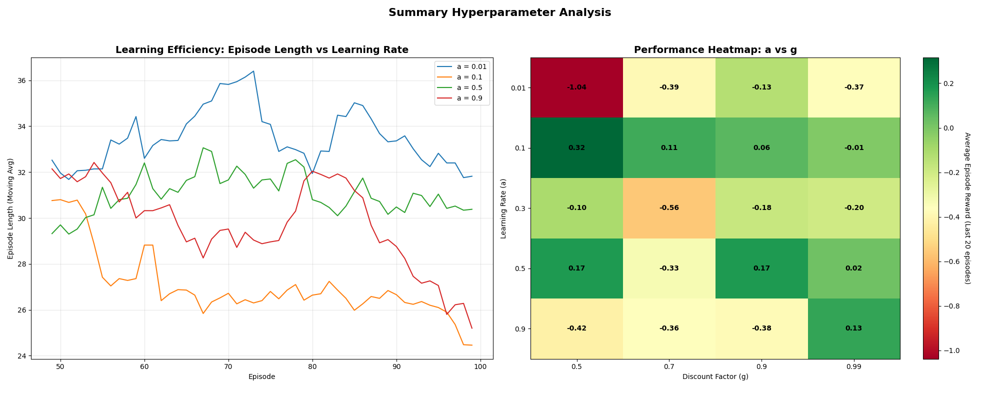
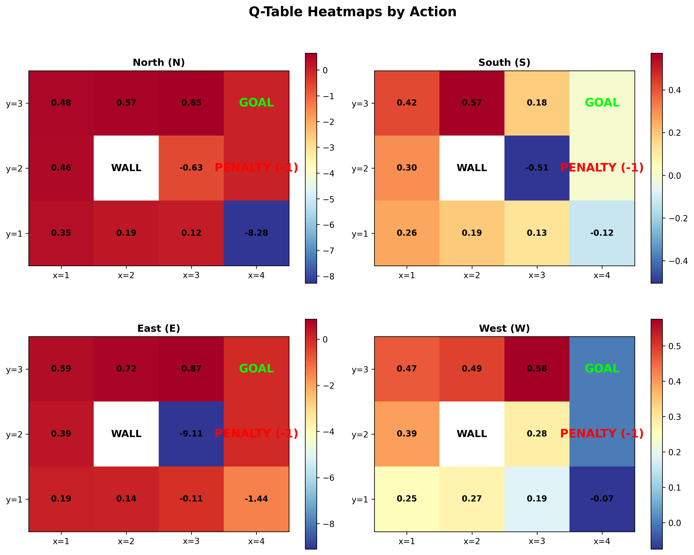

# RL in Robotics: A Q-Learning Adventure in GridWorld

Welcome! This project is a deep dive into the world of Reinforcement Learning (RL), using the classic Q-learning algorithm to teach an agent how to navigate a tricky GridWorld. But it's more than just a simple implementation; it's a complete toolkit for exploring how different parameters shape an AI's learning process.

Think of it as a science lab for RL. You can tweak the agent's "personality" (its hyperparameters) and see exactly how it affects its ability to learn, adapt, and succeed.

## 🎯 What's Inside?

This isn't just about getting from a start to a goal. It's about understanding the *how* and *why* of the learning process.

### Key Features:

-   **Smart Q-Learning Agent**: A from-scratch implementation of the Q-learning algorithm.
-   **An Unpredictable World**: The agent moves in a stochastic environment, meaning actions aren't always perfect. There's an 80% chance of success, and a 10% chance of veering left or right, just like in the real world where things don't always go as planned.
-   **Hyperparameter Playground**: The fun part! The code automatically runs experiments to see how the learning rate (α), discount factor (γ), and exploration strategy (ε) change the agent's behavior.
-   **Rich Visualizations**: It's one thing to run experiments, but another to see the results. The script generates beautiful, detailed plots that show you everything from the agent's convergence path to a heatmap of its performance.
-   **Adaptable Scenarios**: You can change the stakes by setting a high penalty for certain tiles, forcing the agent to learn a completely different, safer path.
-   **Clean, Modern Code**: The project is built with modern Python practices, making it easy to read, extend, and learn from.

## 📊 See the Learning in Action

The best part of this project is the automatic analysis. After the agent is trained, the script produces a comprehensive plot that gives you a bird's-eye view of the entire learning journey.



This visualization helps you answer questions like:

1.  **Is the agent actually learning?** (Q-Value Convergence)
2.  **How successful is it?** (Learning Performance)
3.  **How quickly does it find the goal?** (Learning Efficiency)
4.  **Which settings work best?** (A heatmap showing performance across different `alpha` and `gamma` values)

## 🏗️ The Grid World Environment

Here's the world our agent lives in. It's a simple 4x3 grid with a goal, a penalty (a "trap"), and a wall.

```
+---+---+---+---+
|   |   |   | +1|  <-- The Goal! (Reward: +1.0)
+---+---+---+---+
|   |XXX|   | -1|  <-- The Trap! (Reward: -1.0)
+---+---+---+---+
| S |   |   |   |  <-- Our brave agent starts here.
+---+---+---+---+
```

-   **States**: 11 places the agent can be.
-   **Actions**: The four cardinal directions (North, South, East, West).
-   **The Twist**: The world is stochastic. When the agent decides to move, it only has an 80% chance of going in the intended direction. The other 20% of the time, it might drift off course.

## 🧠 The Brains: Q-Learning

The agent uses the Q-learning algorithm to figure out the best action to take in any given state. It learns by updating its "Q-table" using this formula:

```
Q(s,a) ← Q(s,a) + α[r + γ·max(Q(s',a')) - Q(s,a)]
```

In simple terms: the value of taking an action `a` in a state `s` is updated based on the reward `r` and the best possible value it could get in the next state `s'`.

-   **α (alpha)**: The **Learning Rate**. How much should new information override old information?
-   **γ (gamma)**: The **Discount Factor**. How much does the agent value future rewards over immediate ones?
-   **ε (epsilon)**: The **Exploration Rate**. How often should the agent try a random action to explore the world, versus taking the action it thinks is best?

## 📋 What You'll Need

-   Python 3.11 or newer.
-   A love for cool graphs (`matplotlib`).
-   A need for speed (`numpy`).

## ⚙️ Get Started

This project uses [**UV**](https://docs.astral.sh/uv/), a super-fast Python package manager that makes setup a breeze.

1.  **Install UV** (if you don't have it):

    ```bash
    # On macOS, Linux, or WSL
    curl -LsSf https://astral.sh/uv/install.sh | sh
    ```

2.  **Clone the project and get inside**:

    ```bash
    git clone https://github.com/Jeevan-HM/RL-in-Robotics.git
    cd RL-in-Robotics
    ```

3.  **Sync up!** UV will create a virtual environment and install everything you need in one command:
    ```bash
    uv sync
    ```

That's it! You're ready to go.

## 🚀 Run the Main Analysis

To run the full hyperparameter analysis and generate all the plots, just run the `main.py` script:

```bash
uv run python main.py
```

The script will train the agent under different conditions and save the analysis plots in the `images/` directory. You'll see progress updates printed to the console as it works.

### Command-Line Options

You can also customize the run. For example, to run for more episodes or with a higher penalty:

```bash
uv run python main.py --episodes 20000 --penalty -50.0
```

Use the `--help` flag to see all available options:

```bash
uv run python main.py --help
```

## 🎨 Visualize the Q-Table

Ever wonder what the agent is "thinking"? You can generate a heatmap of the Q-table to see which states it values most.



This gives you a fascinating look into the agent's learned knowledge, showing the paths it has identified as valuable.

## 🤝 Contributing

This was a fun project to build, and I'm always open to ideas! If you have suggestions for improvements, feel free to open an issue or submit a pull request.

## 📜 License

This project is open-source, under the MIT License. See the `LICENSE` file for more details.
