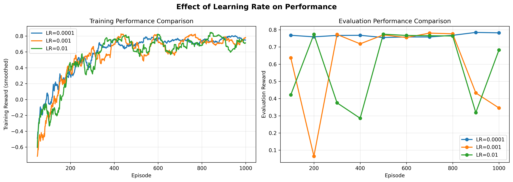

marp: true
theme: gaia
size: 16:9
paginate: true

<!--
This is the CSS style block. It imports the 'Inter' font and sets up a
clean color scheme and layout for the presentation.
-->

<!-- _class: lead -->

<!-- _footer: Jeevan Hebbal Manjunath (ASU) -->

Deep Q-Network Solution for Stochastic Gridworld Navigation

A Reinforcement Learning Project

<!-- _header: The Problem -->

<!-- _footer: Slide 2 / 8 -->

The Problem: A Stochastic Gridworld

<!-- Added missing image directive -->

The goal is to train an agent to find the best path in a 3x4 grid.

Goal: (0,3) | Reward: +1.0

Trap: (1,3) | Reward: -1.0

Obstacle: (1,1) | Impassable Wall

Step Cost: Every move costs -0.04 to encourage efficiency.

<!-- _header: The Challenge -->

<!-- _footer: Slide 3 / 8 -->

The Challenge: An Unreliable World

This isn't a simple pathfinding problem. The environment is stochastic.

When the agent chooses an action (e.g., "Go North"):

80% Chance: It succeeds.

20% Chance: It "slips" and moves sideways (10% left, 10% right).

This means the agent can't just memorize a path. It must learn a robust policy that works even when its actions fail.

<!-- _header: The Solution -->

<!-- _footer: Slide 4 / 8 -->

Our Solution: Deep Q-Network (DQN)

<!-- Added missing image directive -->

Instead of a simple lookup table, we use a neural network (the "brain") to approximate the best action for any given state.

Input: 12-dim One-Hot Vector (Agent's current state)

"Brain": 2 Hidden Layers (64, 64 neurons)

Output: 4 Q-Values (Predicted reward for moving N, S, E, or W)

<!-- _header: How It Learns -->

<!-- _footer: Slide 5 / 8 -->

How it Learns: The Training Loop

The agent learns using two key DQN techniques:

Experience Replay (The "Memory")

The agent stores experiences (state, action, reward, next_state) in a 10,000-item buffer.

It trains by sampling a random batch of 32 old experiences. This breaks correlations and stabilizes learning.

Target Network (The "Anchor")

A second, identical network is used to provide a stable learning target.

It's updated only every 100 steps, preventing the agent from "chasing a moving target" and allowing it to converge.

<!-- _header: Training Results -->

<!-- _footer: Slide 6 / 8 -->

Training Results: A Clear Success

<!-- Added missing image directive -->

The agent was trained for 2,000 episodes.

Learning Curve: Performance rapidly improves around episode 300.

Convergence: The policy becomes stable and near-optimal after ~1,000 episodes.

Final Performance: The agent achieves a final mean reward of $0.82 \pm 0.05$.

<!-- _header: Key Findings -->

<!-- _footer: Slide 7 / 8 -->

Key Insight: Finding the "Sweet Spot"

Performance is highly sensitive to hyperparameters. We ran experiments to find the optimal settings.

<h3>Learning Rate</h3>
<ul>
<li><b>Too High (0.01):</b> Unstable.</li>
<li><b>Too Low (0.0001):</b> Too slow.</li>
<li><b>Just Right (0.001):</b> Fast & stable.</li>
</ul>

<h3>Network Size</h3>
<ul>
<li><b>Too Small ([32]):</b> Failed.</li>
<li><b>Too Big ([64,64,64]):</b> Unstable.</li>
<li><b>Just Right ([64, 64]):</b> Optimal.</li>
</ul>
<!-- Corrected image path -->

<!-- _class: invert -->

<!-- _footer: Thank You -->

Conclusion & The Learned Policy

Success: DQN successfully solved the complex stochastic environment.

The Optimal Policy: The agent learned the 5-step optimal path:
North $\rightarrow$ North $\rightarrow$ East $\rightarrow$ East $\rightarrow$ East

Learned Caution: The policy is robust. From state (0,2), it
strongly prefers moving East (to the goal) over any action that might risk "slipping" into the trap.

Tuning is Key: Finding the right balance for hyperparameters was the most critical factor for success.